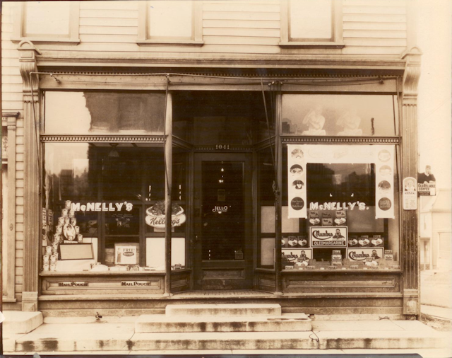

McNelly SoftWorks, LLC Charlotte, NC 28106 Information: [info@mcnellysoftworks.com](mailto:info@mcnellysoftworks.com)

McNelly SoftWorks was founded in 1988 by professional software developer John M. Wargo. The company’s first work was developing utility programs for companies in Northeastern Ohio.

The company’s first project was a utility program installed on every IBM compatible computer sold by a regional PC reseller called Basicomputer (no longer in business). The program displayed a customer’s support contract information on startup and provided an additional menu which helped a remote technician troubleshoot issues with the customer’s computer.

Over the years, the company created additional software applications and provided technical consulting services to companies around the region.

The company’s current software products were designed to simplify data management problems encountered by many Sports Officials and sports organizations. The Official’s Record Keeper program was groundbreaking in that it was a commercial software product specifically designed for Referees – all other products previously had addressed the needs of Game Assignors, not the referees they worked with. McNelly SoftWorks even published a book for brand new Football (Soccer) Referees entitled [_What Now? The Essential Guide for New Soccer Officials_](http://www.mcnellysoftworks.com/what-now-the-essential-guide-for-new-soccer-referees-is-published/ "‘What Now? The Essential Guide for New Soccer Referees’ is published").

The company over the years has delivered consulting services on many IBM Lotus Domino development projects. Company resources are proven experts in IBM Lotus Domino development – having started with Notes 2.0 and over the years created several Notes-related award winning applications and software solutions.

In 2008, the company branched out into mobile. Founder John M. Wargo wrote the first book on BlackBerry development called [BlackBerry Development Fundamental](http://www.blackberrydevelopmentfundamentals.com "BlackBerry Development Fundamentals web site.")s in 2009. He also wrote one of the several available books on the open source PhoneGap framework: [PhoneGap Essentials](http://www.phonegapessentials.com "PhoneGap Essentials Web Site").

In 2010, the company moved to the Charlotte, NC area.

We currently manage several web properties and help local companies with implementation of commercial web sites using open source content management systems (CMS) such as [Joomla!](http://www.joomla.org "Joomla! Project Web Site"), [WordPress](http://www.wordpress.org/ "WordPress project web site"), [Drupal](http://www.drupal.org/ "Drupal Project Web Site") and even [Concrete5](https://www.concrete5.org/ "Concrete5 Project Web site").
