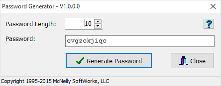

Over the years, McNelly SoftWorks, LLC has created many software utilities to automate processes or procedures for our clients. In this section of the site, we'll publish these utilities so others can make use of them. These utilities are provided as-is, with no warranty, guaranty or expectation that these utilities will work for any purpose.

# Password Generator

We're always looking for a secure and complicated password to use for various online user IDs. Here's a simple application we created that simplifies the process by just generating passwords for you. You tell the application how many characters you want for the password and it generates a new password every time you click the Generate Password button. You can [download the app here](http://mcnellysoftworks.com/ftp/PasswordGenerator.exe).

\[caption id="attachment\_470" align="alignnone" width="444"\] Password Generator Application\[/caption\]
