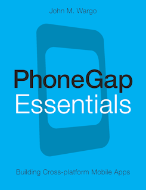

McNelly SoftWorks founder John M. Wargo today announced the public release of his third book: _PhoneGap Essentials_.

Using PhoneGap, mobile developers can write cross-platform mobile apps using standard HTML5, JavaScript, and CSS - and then deploy those apps to every leading mobile platform with little or no recoding. The open source PhoneGap platform has attracted immense interest amongst mobile developers, but its official documentation is sparse and incomplete.

Now, for the first time, there's a concise, practical, developer's guide to succeeding with PhoneGap in real-world mobile development. In the book, I thoroughly introduce the PhoneGap platform: what it is, what it does, and how it works. Next, the book guides developers through configuring their PhoneGap development environments, creating a complete mobile app, and then configuring and building it for leading mobile platforms Android, Bada, BlackBerry, iOS, Symbian and Windows Phone.

Example applications included in the book highlight PhoneGap's APIs, demonstrating how to use mobile platform capabilities ranging from GPS and accelerometers to file systems and built-in applications. Readers also learn how to make the most of PhoneGap Build, PhoneGap's cloud-based packaging utility.

Information about the book can be found on the book’s web site at [www.phonegapessentials.com](http://www.mcnellysoftworks.com/products/officials-record-keeper/ork-trial-download/ "PhoneGap Essentials Web Site") and you can [buy the book from amazon.com.](http://www.mcnellysoftworks.com/products/formblaster/buy-formblaster/ "Amazon book page")
